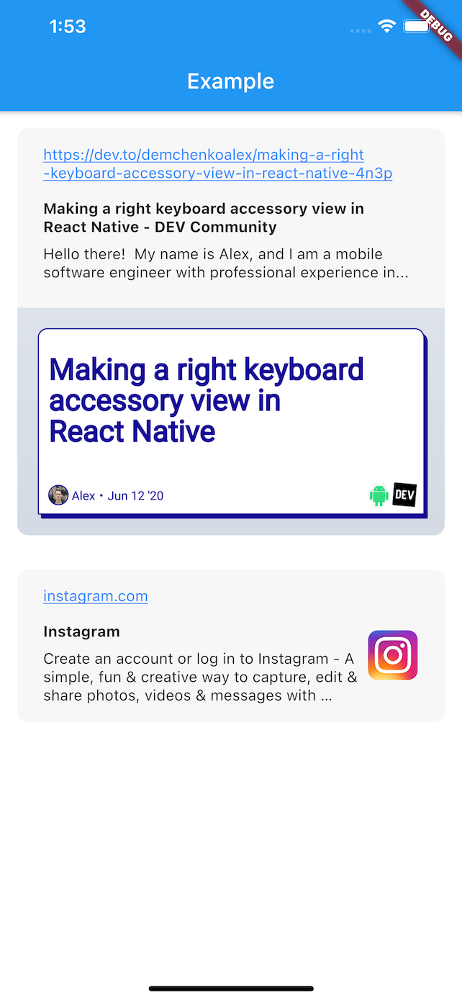

# Flutter Link Preview

URL preview with basic customization and ability to render from cached data



## Getting Started

```dart
LinkPreview(
  onPreviewDataFetched: _onPreviewDataFetched,
  text: 'instagram.com',
  width: MediaQuery.of(context).size.width,
)
```

## Customization

```dart
final style = TextStyle(
  color: Colors.red,
  fontSize: 16,
  fontWeight: FontWeight.w500,
  height: 1.375,
);


LinkPreview(
  linkStyle: style,
  metadataTextStyle: style.copyWith(
    fontSize: 14,
    fontWeight: FontWeight.w400,
  ),
  metadataTitleStyle: style.copyWith(
    fontWeight: FontWeight.w800,
  ),
  padding: EdgeInsets.symmetric(
    horizontal: 24,
    vertical: 16,
  ),
  onPreviewDataFetched: _onPreviewDataFetched,
  text: "Your text with link here",
  textStyle: style,
  width: width,
);
```

## Render from cached data

Store data you get in `onPreviewDataFetched` callback, then

```dart
LinkPreview(
  previewData: _cachedData,
  text: 'instagram.com',
  width: MediaQuery.of(context).size.width,
)
```

## License

[MIT](LICENSE)
